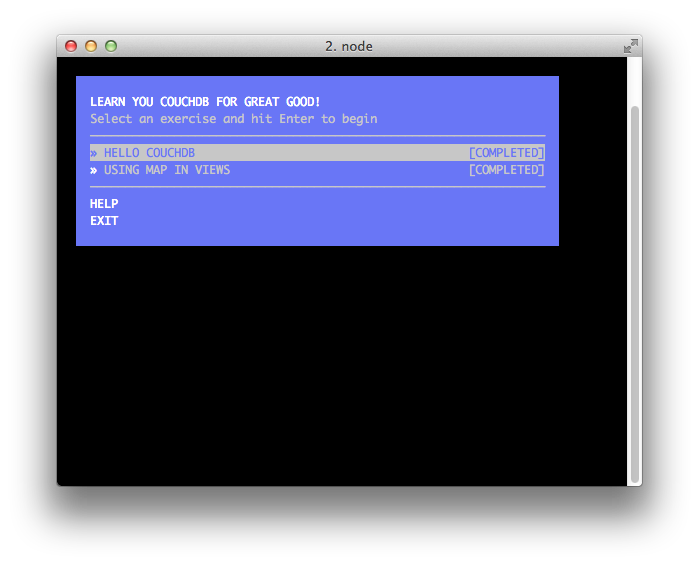

# Learn You CouchDB for great good!

**An intro to CouchDB via a set of self-guided workshops.**

  1. Install [Node.js](http://nodejs.org/)
  2. Run `sudo npm install learnyoucouchdb -g`
  3. Run `learnyoucouchdb`
  4. **.. profit!**

**learnyoucouchdb** will run through a series of CouchDB workshops. Creating databases, documents,
views and much more are parts of learnyoucouchdb.

### Contributors

<b><code>learnyoucouchdb</code></b> is proudly brought to you by the following hackers:

<table><tbody>
<tr><th align="left">Robert Kowalski</th><td><a href="https://github.com/robertkowalski">GitHub/robertkowalski</a></td><td><a href="http://twitter.com/robinson_k">Twitter/@robinson_k</a></td></tr>
</tbody></table>

## License

**learnyoucouchdb** is Copyright (c) Robert Kowalski [@robinson_k](https://twitter.com/robinson_k) and licenced under the MIT licence. See the included LICENSE file for more details.

**learnyoucouchdb** builds on the awesome work by [rvagg](https://github.com/rvagg) who created **[workshopper](https://github.com/rvagg/workshopper)** and **[learnyounode](https://github.com/rvagg/learnyounode)** which builds on the excellent work of [@substack](https://github.com/substack) and [@maxogden](https://github.com/maxogden) who created **[stream-adventure](https://github.com/substack/stream-adventure)** which serves as the original foundation for **learnyoucouchdb**.
